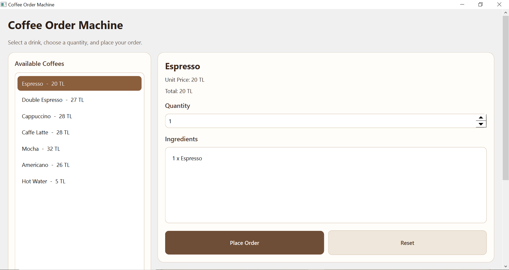
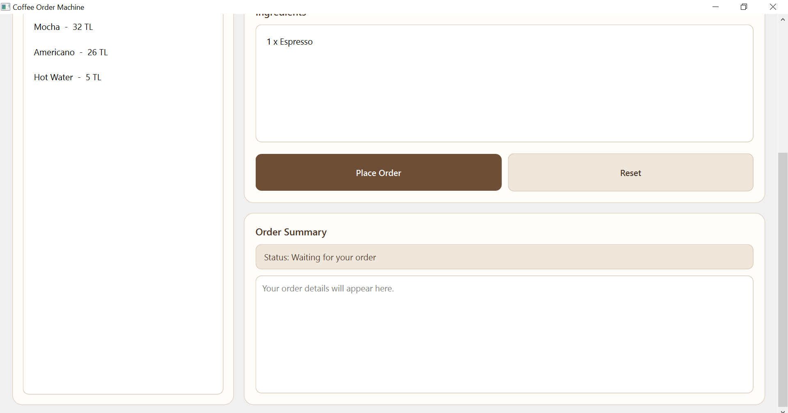
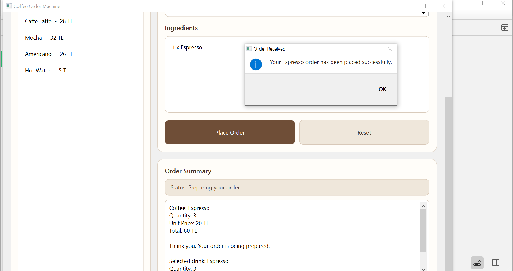

# Coffee Order Machine (Qt GUI)

A desktop-based coffee ordering application built with **C++ and Qt Widgets**.
This project is an extension of a console-based system, redesigned with a modern graphical user interface and improved user experience.

---

## Overview

The application simulates a coffee machine where users can:

* Browse available drinks
* View ingredients and pricing
* Select quantity
* Calculate total cost dynamically
* Place an order and view a summary

The goal of this project is to demonstrate **object-oriented design, clean architecture, and GUI development with Qt**.

---

## Features

* Qt Widgets based graphical user interface
* Dynamic coffee selection
* Ingredient visualization
* Quantity selection
* Real-time total price calculation
* Order summary panel
* Status feedback system
* Reset functionality
* Styled UI using Qt Stylesheets

---

## Screenshots

### Main Interface

<p align="center">
  
  
</p>

### Order Summary

<p align="center">
  
</p>


## Technologies Used

* C++
* Qt 6 (Qt Widgets)
* CMake
* Object-Oriented Programming (OOP)

---

## Project Structure

```
CoffeeOrderMachineQt/
│
├── main.cpp
├── mainwindow.h / mainwindow.cpp
├── coffee.h / coffee.cpp
├── coffeemenu.h / coffeemenu.cpp
├── coffeeorderservice.h / coffeeorderservice.cpp
├── CMakeLists.txt
└── screenshots/
```

---

## How to Build and Run

### Using Qt Creator

1. Open `CMakeLists.txt` in Qt Creator
2. Select kit: `Desktop Qt 6.x MinGW 64-bit`
3. Choose: **Build & Run without deployment**
4. Click Run

---

### Using Terminal (CMake)

```bash
mkdir build
cd build
cmake ..
cmake --build .
./CoffeeOrderMachineQt
```

---

## Architecture

The project follows a modular and maintainable design:

* **Coffee**
  Represents a coffee item (name, price, ingredients)

* **CoffeeMenu**
  Manages available coffee options

* **CoffeeOrderService**
  Handles business logic (order processing, calculations)

* **MainWindow (Qt GUI)**
  Handles user interaction and UI rendering

This separation ensures scalability and clean code structure.

---

## Improvements Over Console Version

* Transitioned from console-based interaction to GUI
* Added real-time feedback and dynamic updates
* Improved usability and user experience
* Introduced visual structure and layout management

---


## Author

Levent Keskin

Embedded Software Engineer

---

## License

This project is developed for educational purposes.
